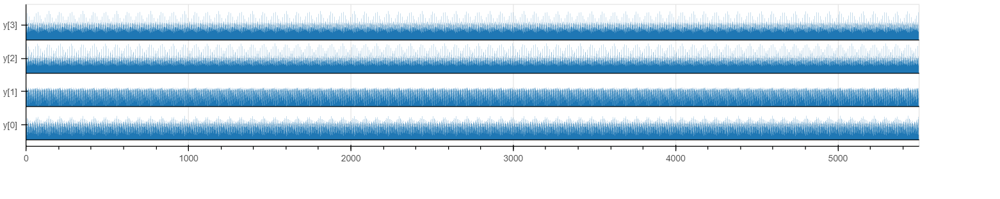

# High-Resolution Heatmap Matrices using Space Filling Curves

Often, when we are given high-resolution data (lots of data points within a small data interval), we perform aggregation (binning) before visualizing it. Heatmap matrices use aggregated functions such as *mean* for computing the "overall" value for each cell and these values are visually encoded by a single color rectangle. We replaced these individual rectangles with Space-Filling Curves (SFCs) which not only visually encode the value of the data points, but also their sequence to some degree. If we use treemap or something similar, we might not get information such as: "Are the two yellow dots occurring in a continuation or after some interval?". Such information can help us differentiate between a high-frequency periodic function vs a low-frequency one. These SFCs can accommodate 10 or 10,000 or even more data points per cell (although the visual space is restricted to the number of pixels per matrix cell).

*Additionally, the neighboring SFCs are concatenated in a way such that the order of data is maintained across cells too. This design choice restricts the type of SFCs that can be used. For instance, we cannot use closed-loop SFCs such as Moore Curve or Sierpinski Square.*

## Example

To explain the utility of this type of encoding, let us consider a modified version of the famous Anscombe's Quartet. Instead of taking two-dimensional data (x,y), we only consider the y-column from the original but repeat it N=500 times. As a result, we obtain the following arrays:

- y[0] = [8.04, 6.95, 7.58, 8.81, 8.33, 9.96, 7.24, 4.26, 10.84, 4.82, 5.68] repeated 500 times = [8.04, 6.95, 7.58, 8.81, 8.33, 9.96, 7.24, 4.26, 10.84, 4.82, 5.68, 8.04, 6.95, ..., 5.68]
- y[1] = [9.14, 8.14, 8.74, 8.77, 9.26, 8.10, 6.13, 3.10, 9.13, 7.26, 4.74] repeated 500 times
- y[2] = [7.46, 6.77, 12.74, 7.11, 7.81, 8.84, 6.08, 5.39, 8.15, 6.42, 5.73] repeated 500 times
- y[3] = [6.58, 5.76, 7.71, 8.84, 8.47, 7.04, 5.25, 12.50, 5.56, 7.91, 6.89] repeated 500 times

and len(y[0]) = len(y[1]) = len(y[2]) = len(y[3]) = 11*25*20 = 5500

### Basic Heatmap Version Vs SFC based High-Resolution Heatmap Version

Now, if we represent this data in a basic heatmap matrix with the following visual encoding:

- Row Ticks = "y[0]", "y[1]", "y[2]", "y[3]"
- Column Ticks = 0 to 219, 220 to 439, ..., 5280 to 5499. (These are the array indices (binned))
- len(Column Ticks) = 25
- Colour of matrix cells: Color_Map(mean(values_in_the_bin))

We get the following Heatmap Matrix:

Since the mean of each cell is almost the same we get a heatmap that gives us no information at all.

Now, with the same data and color map, we try our approach:

### Ridgeline Plot Version  Vs SFC based High-Resolution Heatmap Version

Following is the Ridgeline Plot:

We get such a plot because for sequential or series data, we get only **plot_width (in pixels)** for representing all the data points along the x-axis which is not sufficient for high resolution datasets. But in our heatmap version, we have **plot_width (in pixels) * height_of_one_matrix_row (in pixels)**. In other words, when the data is varying continuously and has a high-resolution, then Ridgeline Plot is almost incomprehensible and this version of heatmap can still visualize such data without the need of smoothing or binning.

## Possible Future Improvements

- Currently, the aspect ratio of each matrix cell should be equal to 1. This aspect ratio constraint needs to be removed.
- Modify the code to accept np.nan (or empty) values.
- Modify the code to accept continuous values as x (instead of just an array index of values)
